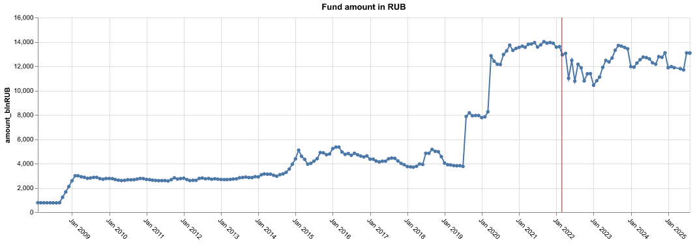
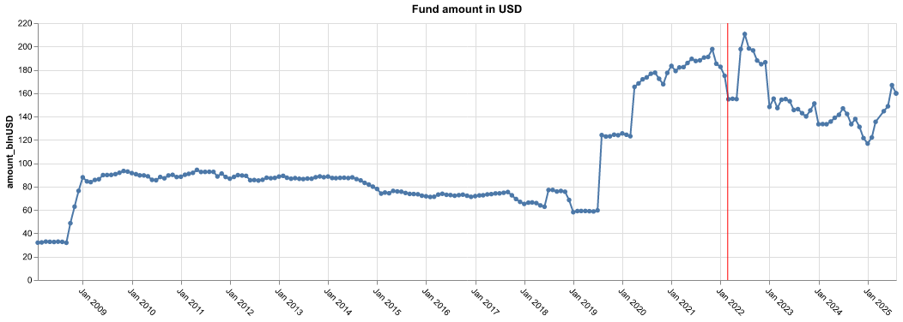

# Russian National Wealth Fund 

Repo for the National Welfare Fund (NWF) data

The NWF is part of the federal budget funds subject to separate accounting and management in order to ensure co-financing of voluntary pension savings of Russian Federation citizens, as well as to balance (cover the deficit of) the federal budget and the budget of the Pension Fund of the Russian Federation.

Management of NWF assets is executed by the Ministry of Finance of the Russian Federation in accordance with procedure and terms established by the Government of the Russian Federation. Bank of Russia may act as operational manager. The National Wealth Fund assets can only be spent to co-finance voluntary pension savings of Russian citizens and to balance budget of Pension Fund of the Russian Federation.

As for the December 25, 2023:

